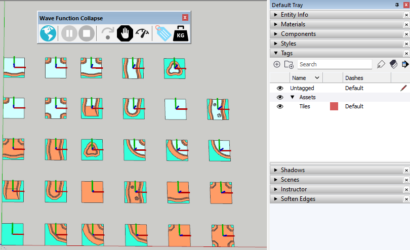
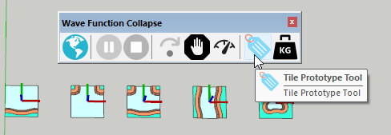
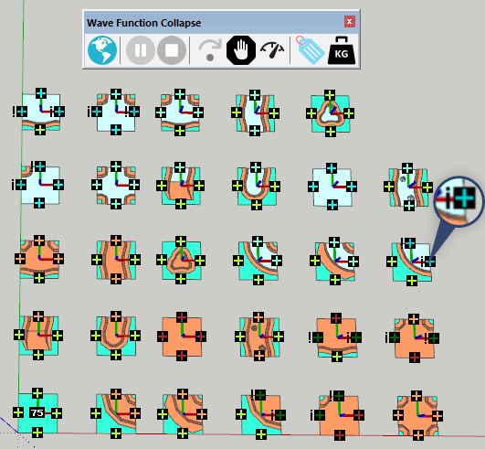
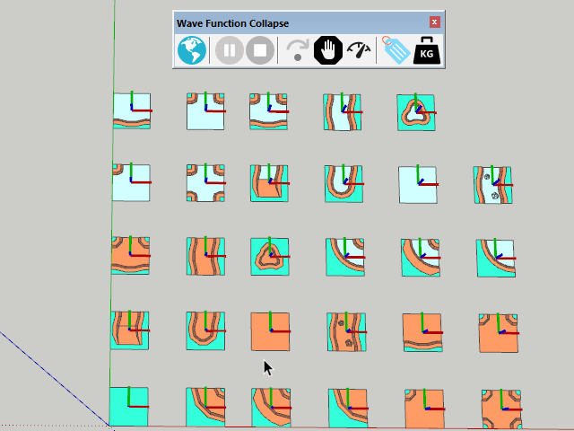
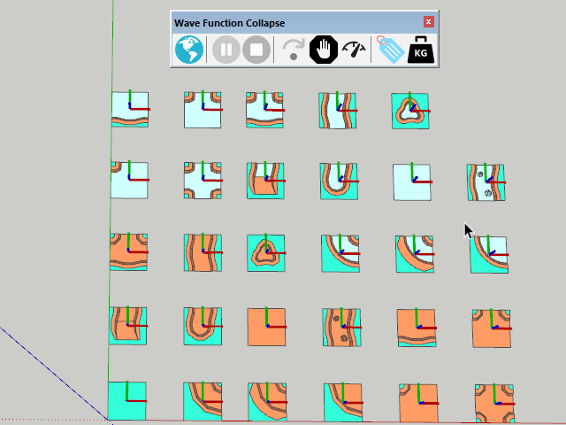
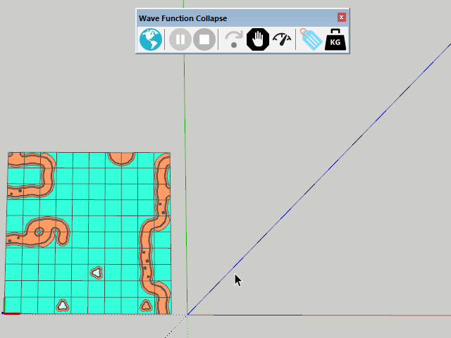

# Wave Function Collapse Experiment

** Warning! ** This is a learning experiment! Don't rely on this project to
be a good example of anything.

This project is based on examples and articles from and derived of https://github.com/mxgmn/WaveFunctionCollapse

Don't refer to this as a good or correct implementation of WFC. Instead check out the [references](References.md).

## The Experiment

The project is a SketchUp extension that takes a set of SketchUp components that acts as tiles in a grid. The bundled example model uses open source assets from [Kenney](https://www.kenney.nl/).



Note that the extension expects the tiles to be 1x1 meters placed on a `Assets/Tiles` tag.

### Defining Tiles

Before the tiles can be used the edges needs some annotation such that the extension can know which tiles can be placed next to each other. For this a custom tool is used:



Before an edge can be assigned with a type the available types needs to be defined:


Edge types that are not symmetrical must be annotated as such and they are represented in the UI with an `!` or `¡` symbol. The presence of either symbol indicates that the tile edge is asymmetrical, and the `¡` variant indicate that it's a reversed version of that edge. In order for two asymmetrical edges to be placed next to each other one must be reversed while the other not.



### Generating

Once the tiles are defined the generation can begin:


The set of tiles used can be narrowed by making a selection before starting the generation:



### Weights

As seen in the previous examples, the generated output is filled heavily with roads/rivers. In order to favour a given tile weights can be applied to adjust the distribution of the various tile types:



## Issues / Questions

### Deriving a new world from existing world

There is functionality that takes an already generated world as the base for the tile set for a new world. Additionally, the weights are derived from the frequency of the source world.

Reference material:
https://robertheaton.com/2018/12/17/wavefunction-collapse-algorithm/

> When using our to analyze the input image, we also need to record the frequency at which each of its tiles appears. We will later use these numbers as weights when deciding which square’s wavefunction to collapse, and when choosing which tile to assign to a square when it is being collapsed.

> The entropy formula used in Wavefunction Collapse is Shannon Entropy. It makes use of the tile weights that we parsed from the input image in the previous step:
> ```
> # Sums are over the weights of each remaining
> # allowed tile type for the square whose
> # entropy we are calculating.
> shannon_entropy_for_square =
>   log(sum(weight)) -
>   (sum(weight * log(weight)) / sum(weight))
> ```



Often the derived worlds are filled with many more roads/rivers than the source world. Haven't done the math on this, but it appear that the constraints of roads/rivers will often force more roads/rivers. The frequency of end tiles is much lower than for straight, corner and intersections - so that leads to higher frequency of roads/rivers.

How can this be tuned to ensure the derived world's frequencies better match the source world?

- Scale the frequency of the tiles in the new world relative to the source world as new tiles are resolved?
  - https://www.gridbugs.org/wave-function-collapse/#relative-tile-frequencies ?
- ???

## Todo (maybe)

- 3 dimensions
- Train the algorithm what the connection rules are based on examples.
